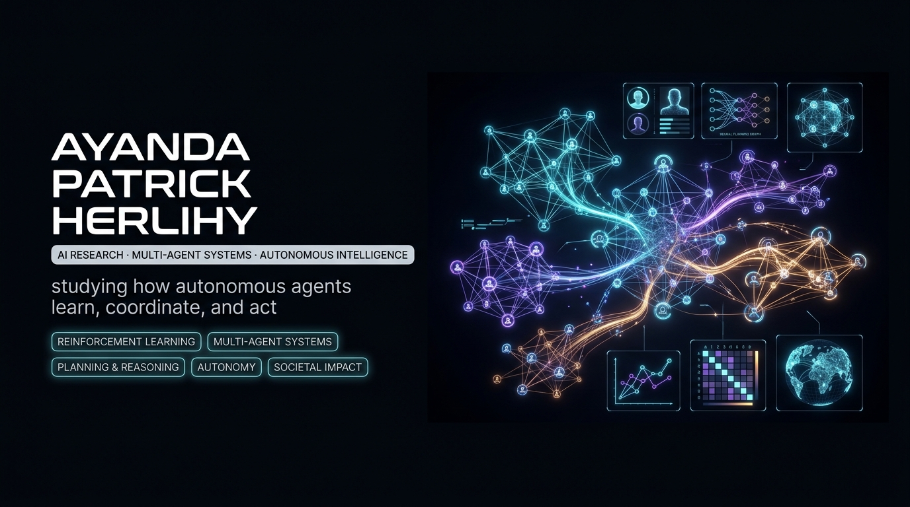
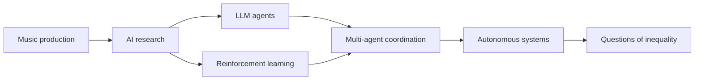

<div align="center">



<p><strong>Computer science graduate preparing for PhD research in LLM agents, reinforcement learning, and multi-agent systems.</strong></p>

<p>Autonomous systems · agent coordination · inequality</p>

<p align="center">
  <a href="https://github.com/jie-jw-wu/ope-agent"></a>
  <a href="https://github.com/Ayanda-Patrick-Herlihy"></a>
</p>

<a href="https://readme-typing-svg.demolab.com">
  
</a>

</div>

---

## Research direction

I study how intelligent systems learn, coordinate, and act.

I keep coming back to one question: how will autonomous systems change access to opportunity? I am especially interested in LLM agents, reinforcement learning, multi-agent coordination, evaluation, and the conditions under which agent behaviour can be trusted.

I came to AI through music production. The medium changed, but I kept the same habit of working through structure, feedback, and iteration.

## Current focus

```python
profile = {
    "background": "Computer science graduate; former music producer",
    "research": [
        "LLM agents",
        "reinforcement learning",
        "multi-agent systems",
        "autonomous systems",
    ],
    "method": [
        "off-policy evaluation",
        "code-modifying agents",
        "reproducible experiments",
        "scientific discovery",
    ],
    "project": "GrowthHacker / ope-agent",
    "long_term_question": "How do autonomous systems reshape inequality?",
}
```

## Research map



## Research project

### [GrowthHacker / ope-agent](https://github.com/jie-jw-wu/ope-agent)

An automated off-policy evaluation system that uses code-modifying LLM agents to search for better estimators and experiment designs. It tests whether agents can improve evaluation code through repeated, measurable experiments.

I am a co-first author on the accompanying paper, [*GrowthHacker: Automated Off-Policy Evaluation Optimization Using Code-Modifying LLM Agents*](https://arxiv.org/abs/2511.00802).

## Technical interests

<div align="center">

<p align="center">
  <a href="https://skillicons.dev"></a>
</p>

<p align="center">
  
  
  
  
  
</p>

</div>

## What I am building toward

<details>
<summary>Long-term research direction</summary>

I want to study autonomous systems as social technologies as well as engineering systems.

That means asking how they work, who can use them, and who benefits when they are deployed.

</details>

<details>
<summary>Why music still matters</summary>

Music production taught me to work through iteration, feedback, and structure. Moving into AI changed the medium, not the curiosity: I still want to understand how complex systems behave when people shape and test them.

</details>

---

<p align="center">Researching agents, learning, and autonomy.</p>
